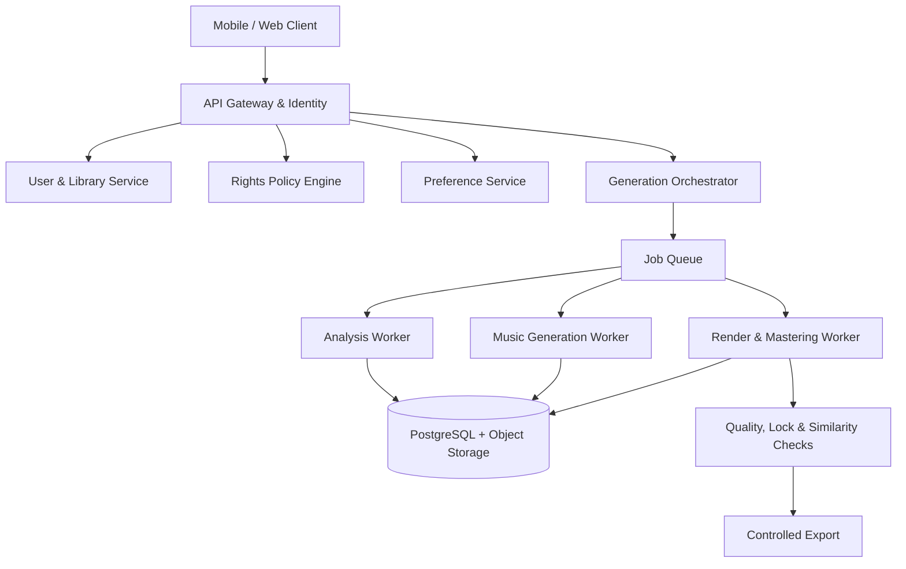

# MayaTune

> An AI-powered music application that personalizes listening experiences for each listener, context, and purpose.

**Project status:** Product definition / PRD baseline  
**Current product priority:** MayaTune Listener  
**Launch use case:** Workout Personalization  
**Next roadmap product:** MayaTune Creator Voice

[Vietnamese](./README.vi.md)

## Overview

MayaTune helps everyday listeners adapt music without requiring music-production knowledge. Users choose a context, describe what they want, and compare several personalized versions, for example:

- increase energy for a run;
- shorten the intro and bring the chorus in earlier;
- reduce vocals for focused work;
- create playlists with consistent BPM, energy, and loudness;
- transform a licensed song from one genre to another while preserving selected elements;
- generate a new song from a Preference Profile instead of copying a reference track.

**Value proposition:** Music adapts to you, instead of you adapting to one fixed version of a song.

## Product Strategy

### 1. MayaTune Listener—current priority

Designed for everyday listeners. The product learns from preferences, selections, and listening behavior to generate versions that become more relevant over time.

Three foundational capabilities:

| Capability | Purpose | Examples |
|---|---|---|
| **Adjust** | Modify authorized content while keeping its identity and genre relatively stable | Tempo, energy, vocals, bass, intro, duration |
| **Transform** | Create a new arrangement, use-context version, or genre transformation; includes **Music Style Transfer** | Pop → Rock, Ballad → EDM, Hip-hop → Jazz, Workout, Focus, acoustic |
| **Create New** | Generate an independent song from abstract musical attributes and preferences | Preserve mood/energy while creating a new melody, lyrics, hook, and structure |

### 2. MayaTune Creator Voice—future roadmap

Designed for content creators who want to produce songs, jingles, and short-form content using **their own verified voice**.

Creator Voice will require:

- identity verification and proof of rights to the voice;
- a liveness check;
- explicit consent by purpose and duration;
- workspace and team permissions;
- provenance for every exported file;
- the ability to lock, revoke, and delete a voice model.

Creator Voice is not intended to imitate celebrities or any person without valid consent.

## MayaTune Listener MVP

### Initial User

People who listen to music every day while exercising, working, studying, or commuting, but who do not have arranging or music-production skills.

### Job to Be Done

> When I am preparing for an activity, I want music to adapt automatically to my state and preferences so I do not have to search for or manually edit a playlist.

### P0 Scope

- pairwise audio-comparison onboarding;
- a Music Preference Profile;
- a catalog with explicit operation rights;
- authorized user uploads with rights declarations;
- Workout context, duration, energy curve, and familiarity controls;
- analysis of BPM, key, structure, mood, energy, loudness, vocals, and instrumentation;
- an AI Music Brief;
- conversion of prompts and presets into an inspectable Edit Recipe;
- basic Adjust controls;
- Music Style Transfer for supported, rights-cleared genre pairs;
- three candidates: **Familiar**, **Personal**, and **Explore**;
- A/B listening, quick feedback, refinement, and regeneration;
- Personal Stations, version history, and controlled export;
- provenance, quality checks, rights auditing, deletion, and cost telemetry.

### P1 Scope

- Focus Personalization;
- Create New from a Preference Profile or abstract reference attributes;
- advanced personalized ranking;
- expanded instrumental and preference controls.

### Out of Scope for the Listener MVP

- unrestricted remixing of all commercial songs;
- copying the melody, lyrics, hook, master recording, or voice of a reference-only track;
- generating content that is “exactly like” a specific artist;
- cloning another person's voice without consent;
- one-click commercial release or a public remix social network;
- Creator Voice functionality.

## Music Style Transfer

Music Style Transfer preserves user-selected, rights-permitted components of a song while changing its arrangement, harmony treatment, rhythm, groove, instrumentation, sound design, production style, and potentially its genre.

Examples:

- Pop → Rock;
- Ballad → EDM;
- Hip-hop → Jazz;
- Acoustic → Lo-fi.

### Preserve Locks

- **Lyrics Lock**—preserve lyric content and line order.
- **Main Melody Lock**—preserve the main vocal melody within tolerance.
- **Vocal Lock**—preserve the original vocal recording or stem when available and permitted.
- **Hook Lock**—preserve the licensed recognizable hook.
- **Structure Lock**—preserve verse, chorus, bridge, and relative order.
- **Harmony Lock**—preserve chord progression while changing voicing/instrumentation.
- **Duration Lock**—keep duration close to the source when selected.

Style Transfer is enabled only when the Rights Policy Engine confirms the relevant derivative, composition, lyrics, master/vocal, and export permissions. A reference-only song cannot enter this flow; MayaTune recommends Create New instead.

## Core Experience

```text
Preference onboarding
        ↓
Select Workout + duration
        ↓
Choose a rights-cleared catalog track / authorized file / reference source
        ↓
Rights eligibility check
        ↓
Track Analysis + AI Music Brief
        ↓
Choose Adjust or Transform
        ↓
Prompt/preset + Preserve Locks + intensity
        ↓
Review the Edit Recipe
        ↓
Generate Familiar / Personal / Explore
        ↓
A/B listen, provide feedback, and refine
        ↓
Save a version / Personal Station
        ↓
Controlled export or continued in-app listening
```

## Personalization

MayaTune combines four signal types:

1. **Declared preferences:** genre, BPM, vocals, bass, activity, and creativity level.
2. **Selections:** chosen candidate, regeneration, and preference for remaining closer to the original.
3. **Listening behavior:** completion, skipping, replaying, and seeking to specific sections.
4. **Context:** Workout, Focus, session duration, and device.

Initially, the system generates several candidates and uses the Preference Profile to rank them instead of training a separate music-generation model for every user.

## Proposed Architecture



### Generation Adapter

AI models and providers sit behind a common interface:

```text
analyze(track, operation_context)
separate_stems(track, requested_stems)
plan_candidates(analysis, recipe, profile)
generate_variant(track, recipe, candidate_profile)
master(version, target_profile)
score_quality(source, version, recipe)
score_similarity(reference_set, version)
```

## Rights, Safety, and Data

Every track must have a rights state before processing. That state determines whether the track may be analyzed, adjusted, transformed, stored privately, shared, exported, or used commercially.

Foundational principles:

- a reference track contributes only policy-permitted abstract attributes such as mood, BPM, and energy;
- MayaTune does not copy melody, lyrics, hooks, recordings, or a singer's voice by default;
- generation and export store a Rights Snapshot, provenance, and an audit trail;
- export always re-checks the current rights state;
- audio is encrypted in transit and at rest;
- user audio is not used to train a shared model by default;
- users can delete source files, generated versions, stations, and related profile data.

## Roadmap

| Milestone | Scope |
|---|---|
| **A—Listener Foundation** | Onboarding, profile, catalog, rights, analysis, prompt-to-recipe, three candidates |
| **B—Adaptive Listening** | Workout/Focus Stations, playlist adaptation, personalized ranking |
| **C—Original Music** | Create New from the Preference Profile with similarity safeguards |
| **D—Creator Identity** | Identity verification, voice enrollment, liveness, consent ledger |
| **E—Creator Voice Studio** | Lyrics-to-song, vocal production, jingles, short-form versions |
| **F—Creator Teams** | Workspace, permissions, approvals, licensing, audit, API |

## Primary Metric

**North Star Metric:** minutes spent listening to personalized versions that users actively select again.

Supporting metrics include candidate-selection rate, completion and replay rates, Personal Stations per user, rendering cost per accepted listening minute, generation latency, artifact rate, and the share of jobs blocked by rights policy.

## Proposed Repository Structure

```text
.
├── apps/
│   ├── mobile/
│   └── web/
├── services/
│   ├── api/
│   ├── generation-orchestrator/
│   ├── audio-analysis/
│   ├── rights/
│   └── preferences/
├── packages/
│   ├── schemas/
│   └── shared/
├── infrastructure/
├── tests/
│   └── audio-fixtures/
├── docs/
│   ├── MayaTune_Listener_MVP_PRD_v0.1_EN.docx
│   └── MayaTune_Listener_MVP_PRD_v0.1_EN.md
├── MayaTune_Project_Log_EN.docx
├── README.vi.md
└── README.md
```

The structure is an initial proposal and will be refined after the technical stack and implementation plan are locked.

## Project Documentation

- [MayaTune Project Log—English](./MayaTune_Project_Log_EN.docx)—living record of decisions, work entries, roadmap items, risks, and next actions.
- [MayaTune Listener MVP PRD v0.1—English DOCX](./MayaTune_Listener_MVP_PRD_v0.1_EN.docx)—formatted cross-functional product baseline.
- [MayaTune Listener MVP PRD v0.1—English Markdown](./MayaTune_Listener_MVP_PRD_v0.1_EN.md)—repository-friendly source copy.
- [Vietnamese README](./README.vi.md)

## Next Step

Execute two workstreams in parallel:

1. **Product/UX Definition Pack v0.1:** user flows, low-fidelity wireframes, state matrix, Edit Recipe JSON Schema, Rights Policy contract, and analytics schema.
2. **Technical Feasibility Spike:** benchmark stems, Preserve Locks, Music Style Transfer quality, latency, cost, and supported genre pairs.

The results will feed **System Design v0.1**, sprint planning, and `LOG-003`.

## Contribution and License Status

The project is currently in the product-definition phase. Contribution guidelines, development conventions, and licensing will be added after the repository structure and release model are finalized.
