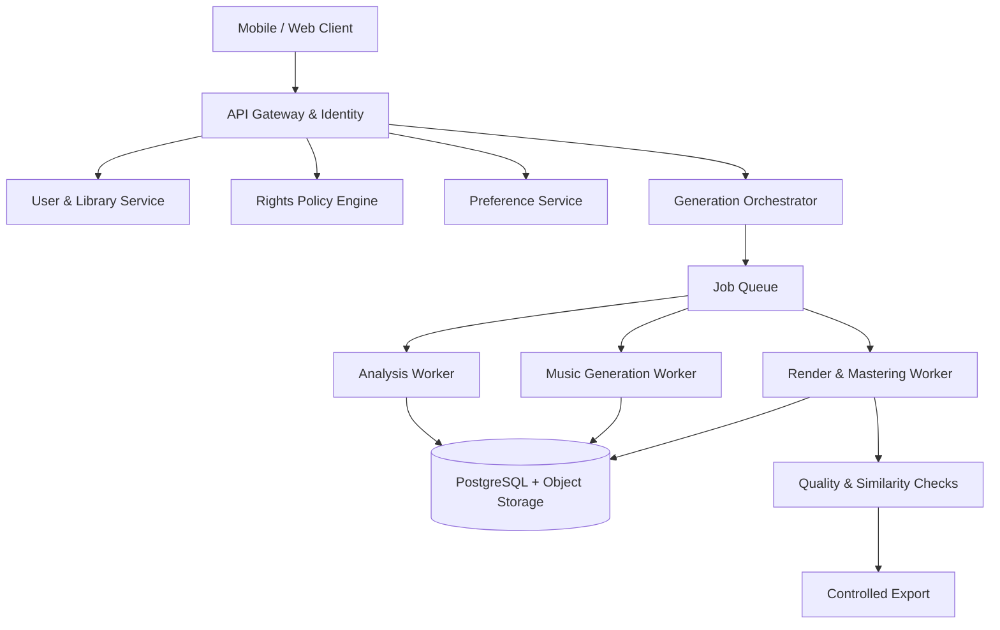

# MayaTune

> Ứng dụng AI cá nhân hóa âm nhạc theo người nghe, bối cảnh và mục đích sử dụng.

**Trạng thái dự án:** Product discovery  
**Phiên bản sản phẩm đang ưu tiên:** MayaTune Listener  
**Use case ra mắt:** Workout Personalization  
**Roadmap tiếp theo:** MayaTune Creator Voice

## Tổng quan

MayaTune giúp người nghe phổ thông điều chỉnh trải nghiệm âm nhạc mà không cần biết sản xuất nhạc. Người dùng có thể chọn một bối cảnh, mô tả điều mình muốn và nghe nhiều phiên bản được cá nhân hóa, chẳng hạn:

- tăng năng lượng cho buổi chạy;
- rút ngắn intro và đưa chorus xuất hiện sớm hơn;
- giảm vocal để tập trung;
- tạo playlist có BPM, năng lượng và âm lượng đồng đều;
- tạo một bài hát mới dựa trên hồ sơ sở thích thay vì sao chép bài tham chiếu.

**Tuyên bố giá trị:** Âm nhạc phù hợp với bạn, thay vì bạn phải thích nghi với bài hát.

## Chiến lược sản phẩm

### 1. MayaTune Listener — ưu tiên hiện tại

Dành cho người nghe phổ thông. Sản phẩm học từ sở thích, lựa chọn và hành vi nghe để tạo ra các phiên bản phù hợp hơn theo thời gian.

Ba khả năng nền tảng:

| Khả năng | Mục đích | Ví dụ |
|---|---|---|
| **Adjust** | Điều chỉnh nội dung được phép xử lý | Tempo, energy, vocal, bass, intro, duration |
| **Transform** | Tạo arrangement cho một hoàn cảnh mới | Workout, Focus, instrumental, acoustic |
| **Create New** | Tạo bài mới từ thuộc tính trừu tượng | Giữ mood/năng lượng, tạo melody và cấu trúc mới |

### 2. MayaTune Creator Voice — roadmap sau

Dành cho nhà sáng tạo nội dung muốn tạo bài hát, jingle và nội dung ngắn bằng **chính giọng đã được xác minh của họ**.

Creator Voice sẽ yêu cầu:

- xác minh danh tính và quyền đối với giọng;
- liveness check;
- consent rõ ràng theo mục đích và thời hạn;
- phân quyền cho workspace/team;
- provenance cho mọi file xuất;
- khả năng khóa, thu hồi và xóa voice model.

Creator Voice không được thiết kế để mô phỏng người nổi tiếng hoặc bất kỳ người nào không có sự đồng ý hợp lệ.

## MayaTune Listener MVP

### Người dùng đầu tiên

Người nghe nhạc hằng ngày khi tập thể dục, làm việc, học tập hoặc di chuyển nhưng không có kỹ năng phối khí hay sản xuất âm nhạc.

### Job to be Done

> Khi chuẩn bị thực hiện một hoạt động, tôi muốn âm nhạc tự thích nghi với trạng thái và sở thích của mình để không phải tìm kiếm hoặc chỉnh playlist thủ công.

### Phạm vi chính

- onboarding bằng so sánh các cặp đoạn nhạc;
- Music Preference Profile;
- catalog có quyền chỉnh sửa rõ ràng;
- phân tích BPM, key, cấu trúc, mood, energy và nhạc cụ;
- chuyển prompt/preset thành Edit Recipe;
- tạo ba ứng viên **Familiar**, **Personal** và **Explore**;
- A/B listening và phản hồi nhanh;
- Personal Stations cho Workout, Focus và các bối cảnh khác;
- controlled export theo quyền nguồn;
- provenance, quality checks và similarity safeguards.

### Ngoài phạm vi MVP

- remix không giới hạn mọi bài hát thương mại;
- sao chép melody, lời, hook hoặc bản ghi của bài tham chiếu;
- tạo nội dung “giống hệt” một nghệ sĩ cụ thể;
- nhân bản giọng người khác không có consent;
- phát hành thương mại một chạm hoặc mạng xã hội remix công khai.

## Trải nghiệm chính

```text
Onboarding sở thích
        ↓
Chọn bối cảnh nghe
        ↓
Chọn bài trong catalog / file có quyền / bài tham chiếu
        ↓
Mô tả thay đổi hoặc chọn preset
        ↓
AI tạo Edit Recipe
        ↓
Sinh Familiar / Personal / Explore
        ↓
Nghe A/B và phản hồi
        ↓
Lưu Personal Station
```

## Cá nhân hóa

MayaTune kết hợp bốn loại tín hiệu:

1. **Khai báo:** thể loại, BPM, vocal, bass, hoạt động và mức sáng tạo.
2. **Lựa chọn:** phiên bản được chọn, tạo lại hoặc giữ gần bản gốc hơn.
3. **Hành vi nghe:** nghe hết, bỏ qua, nghe lại và tua đến đoạn cụ thể.
4. **Bối cảnh:** Workout, Focus, thời lượng phiên nghe và thiết bị.

Ở giai đoạn đầu, hệ thống tạo nhiều ứng viên rồi dùng Preference Profile để xếp hạng thay vì huấn luyện một mô hình sinh nhạc riêng cho từng người dùng.

## Kiến trúc dự kiến



### Generation Adapter

Các mô hình hoặc nhà cung cấp AI được đặt sau một interface chung:

```text
analyze(track)
separate_stems(track)
generate_variants(track, recipe)
extend_section(track, section, recipe)
master(version)
score_similarity(source, version)
```

## Quyền, an toàn và dữ liệu

Mọi track cần có trạng thái quyền trước khi xử lý. Quyền này quyết định khả năng preview, chỉnh sửa, lưu riêng tư, chia sẻ, xuất và sử dụng thương mại.

Nguyên tắc nền tảng:

- bài tham chiếu chỉ cung cấp thuộc tính trừu tượng như mood, BPM và energy;
- không mặc định sao chép melody, lời, hook, bản ghi hoặc giọng ca sĩ;
- audio được mã hóa khi truyền và lưu;
- không dùng audio người dùng để huấn luyện mô hình chung theo mặc định;
- người dùng có quyền xóa file nguồn và các phiên bản đã tạo;
- mọi file xuất lưu source, recipe, pipeline/model version, thời điểm và trạng thái quyền.

## Roadmap

| Mốc | Nội dung |
|---|---|
| **A — Listener Foundation** | Onboarding, profile, catalog, analysis, prompt-to-recipe, ba phiên bản |
| **B — Adaptive Listening** | Workout/Focus Stations, playlist adaptation và personalized ranking |
| **C — Original Music** | Tạo bài mới từ Preference Profile và similarity safeguards |
| **D — Creator Identity** | Identity verification, voice enrollment, liveness và consent ledger |
| **E — Creator Voice Studio** | Lyrics-to-song, vocal production, jingle và short-form |
| **F — Creator Teams** | Workspace, permissions, approval, licensing, audit và API |

## Chỉ số trọng tâm

**North Star Metric:** số phút nghe các phiên bản được cá nhân hóa và được người dùng chủ động chọn lại.

Các chỉ số hỗ trợ gồm tỷ lệ chọn một trong ba phiên bản, tỷ lệ nghe hết/nghe lại, số Personal Stations, chi phí render trên mỗi phút được nghe và tỷ lệ job bị lỗi hoặc chặn do quyền.

## Cấu trúc repository dự kiến

```text
.
├── apps/
│   ├── mobile/
│   └── web/
├── services/
│   ├── api/
│   ├── generation-orchestrator/
│   ├── audio-analysis/
│   ├── rights/
│   └── preferences/
├── packages/
│   ├── schemas/
│   └── shared/
├── infrastructure/
├── tests/
│   └── audio-fixtures/
├── docs/
├── MayaTune_Project_Log.docx
└── README.md
```

Cấu trúc này là đề xuất ban đầu và sẽ được cập nhật sau khi khóa tech stack cùng PRD.

## Tài liệu dự án

- [MayaTune Project Log](./MayaTune_Project_Log.docx) — living document ghi lại quyết định, log entry, roadmap, rủi ro và bước tiếp theo.

## Bước tiếp theo

Soạn **PRD v0.1 cho MayaTune Listener MVP**, gồm:

- mục tiêu và non-goals;
- persona và user stories;
- luồng và màn hình;
- acceptance criteria;
- analytics events;
- mô hình dữ liệu;
- backlog kỹ thuật;
- kế hoạch kiểm chứng Workout MVP.

## Trạng thái đóng góp và giấy phép

Dự án hiện ở giai đoạn định nghĩa sản phẩm. Hướng dẫn đóng góp, quy tắc phát triển và giấy phép sẽ được bổ sung sau khi cấu trúc repository và mô hình phát hành được khóa.
